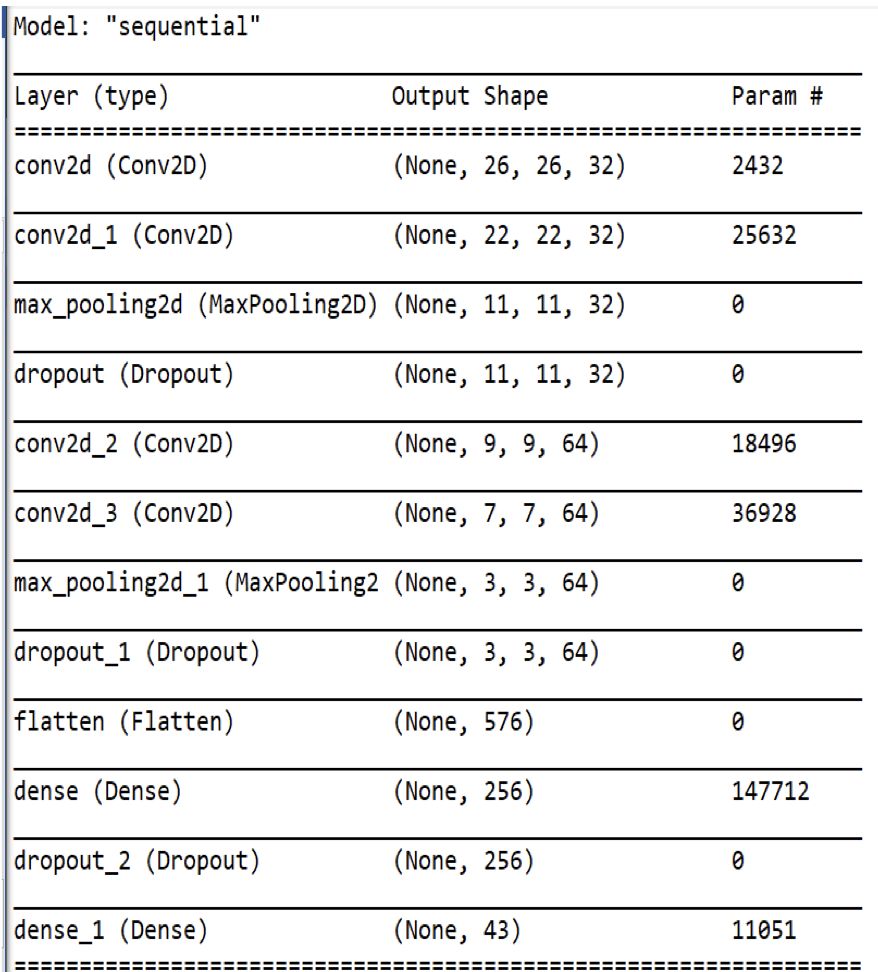

# Traffic (Lecture 5 from CS50 AI)

Designing and training a Convolutional Neural Network to identify traffic signs from photographs.


## Introduction

As the development of self-driving cars progresses, one of the critical challenges lies in computer vision—enabling vehicles to interpret their surroundings through digital images. A fundamental aspect of this capability is the recognition and classification of road signs such as stop signs, speed limits, and yield signs.

For this project, TensorFlow is employed to construct a neural network that classifies road signs based on photographic images. The model is trained on the German Traffic Sign Recognition Benchmark (GTSRB) dataset, which contains thousands of images categorized into 43 different types of road signs.

## Experimentation

### Base Model (kind of chosen randomly)

- **Architecture:**
  - Convolutional layer with 32 filters (3x3 kernel)
  - 2x2 max pooling layer
  - Hidden layer with 128 nodes (ReLU activation, 50% dropout)
  - Output layer with 43 nodes (softmax activation)
  
- **Training Setup:**
  - Optimizer: Adam
  - Loss function: Categorical Crossentropy
  - Metrics: Accuracy
  
- **Results:**
  - Loss: 3.5011
  - Accuracy: 0.0554
  - Time per epoch: 748ms
  - Time per step: 2ms

- **Learnings:**
  - It's really bad  
  - Experiment with additional hidden layers
  - Test different activation functions

### Looking at research

Lim et al. conducted a meta-analysis of existing research on traffic sign recognition, and compared dozens of machine learning and deep learning models. I chose 2 of the deep learning models with the highest accuracy that used a CNN and the GTSRB to see what I can learn from them.

#### Shustanov et al. Model (see traffic_1.py)

- **Architecture:**
  - Three convolutional layers, with increasing filter count and strides
  - Hidden layer with 512 nodes
  
- **Results:**
  - Loss: 0.2496
  - Accuracy: 0.9459
  - Time per epoch: 465ms
  - Time per step: 1ms

- **Learnings:**
  - Strides define how many pixels to skip when applying the kernel. It can be used as an alternative to max-pooling, to reduce spatial dimensions
  - Increased filter count improves detail capture
  - This model is very efficient, as it only has 3 convolutional layers and still highly accurate. When I tried training it with more epochs (which we can't do in context of this exercise), it got even more accurate to 0.97

#### Agarwal et al. Model (see traffic_2.py)

- **Architecture:**
  - Multiple convolutional and max pooling layers
  - Three dropout layers


  
- **Results:**
  - Loss: 0.1036
  - Accuracy: 0.9736
  - Time per epoch: 4s
  - Time per step: 13ms

- **Learnings:**
  - Achieved higher accuracy and lower loss, albeit at significantly longer training times
  - I also realized that most researchers use much higher amount of epochs to train than 10

#### Experimenting with Augmentation and Batch Normalization (see traffic_3.py)

- **Modifications:**
  - Using the Shustanov et al. model as the base:
  - Added augmentation (rotation, horizontal flipping)
  - Increased filter count in convolutional layers
  - Implemented batch normalization (which can lead to more efficiency with lower amount of epochs)

- **Results:**
  - Loss: 0.2708
  - Accuracy: 0.9186
  - Time per epoch: 1s
  - Time per step: 4ms

- **Conclusion:**
  - Augmentation and batch normalization did not significantly improve performance within the 10-epoch constraint.


## Webapp

Also added a simple webapp to try out the neural net. Just clone the repo, run app.py, and then you can upload an image of a sign.
```
git clone https://github.com/btoksoez/traffic
cd traffic/webapp
pip install -r requirements.txt
```
and then run it and click the link
```
python3.11 app.py
```


## Final words

This was such a cool project and it's astonishing to see that just with a few lines of code, you can train your own neural network. I want to understand more about the underlying math and all the different details. Also, I really liked my approach of looking at existing papers and research, as this field is so well documented. 


## Citations

- Agarwal, S.; X, C.; Kumar, R. Convolutional Neural Network for Traffic Sign Classification. Int. J. Inf. Technol. Proj. Manag. 2022, 9.
- Lim XR, Lee CP, Lim KM, Ong TS, Alqahtani A, Ali M. Recent Advances in Traffic Sign Recognition: Approaches and Datasets. Sensors. 2023; 23(10):4674. [https://doi.org/10.3390/s23104674](https://doi.org/10.3390/s23104674)
- Shustanov A, Yakimov P. CNN Design for Real-Time Traffic Sign Recognition. Procedia Engineering. 2017;201:718-725. [https://doi.org/10.1016/j.proeng.2017.09.594](https://doi.org/10.1016/j.proeng.2017.09.594)
